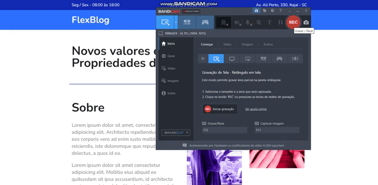
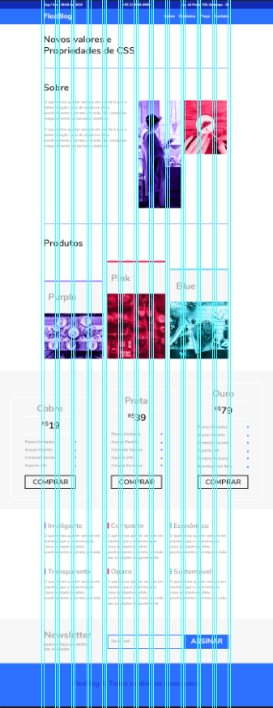
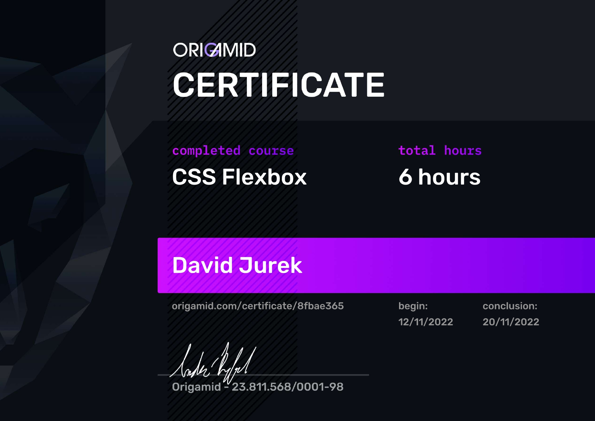

# Introdução
O FlexBlog foi construído a partir do curso CSS Flexbox oferecido pela Origamid, instruído por André Rafael.

### Neste projeto foram utilizados os seguintes conceitos de Flexbox:

- Display Flex
- Flex Direction
- Flex Wrap
- Flex Flow
- Justify Content
- Align Items
- Align Content
- Flex Grow
- Flex Basis
- Flex Shrink
- Flex
- Order
- Align Self

## Confira uma prévia do layout do projeto:

# Prototipo
Para o desenvolvimento deste projeto, foi utilizado o seguinte prototipo:

# Certificação
É com honra que concluo mais este curso oferecido pela Origamid com um grande conhecimento absorvido. Confira abaixo minha certificação deste curso:

Você também pode visualizar minha certificação através do endereço: https://www.origamid.com/certificate/8fbae365